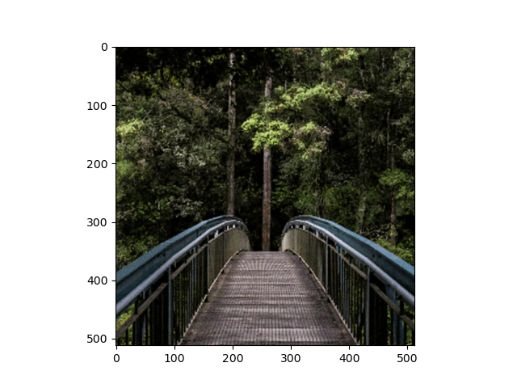
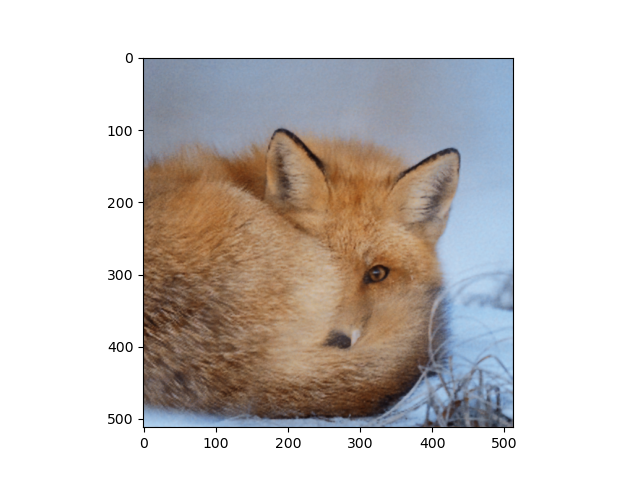

# fourier-dnn


Tensorflow 2.0 implementation of fourier feature mapping networks.

# Results

Results after training fourier feature mapping models for around 100-200 epochs.





# Setup

 - Git clone
 - Install the package locally (the `-e` flag means that any changes you make here in the code will be
    reflected in the package)
    ```bash
    pip install -e .
    ```
# Usage

Check out the [2D image regression example](fourier_dnn/2d_image_regression.py) for an example
usage.

Run the example using:
```bash
python ./fourier_dnn/2d_image_regression.py 3 100
```
where `3` is the image index from the dataset (of 16 images) and `100` is the number of epochs.
(Dataset taken from the [original
implementation](https://github.com/tancik/fourier-feature-networks))

Use `fourier_dnn.ffm_mlp.FourierMLP` to make a complete fourier feature mapping network.
For example:
```python
model = FourierMLP(10, 256, 3,
                   gaussian=True, staddev=16,
                   num_units_FFM=256)
```

Use `fourier_dnn.metrics.PSNR` as a metric for `model.compile` to get PSNR values on every epoch.

